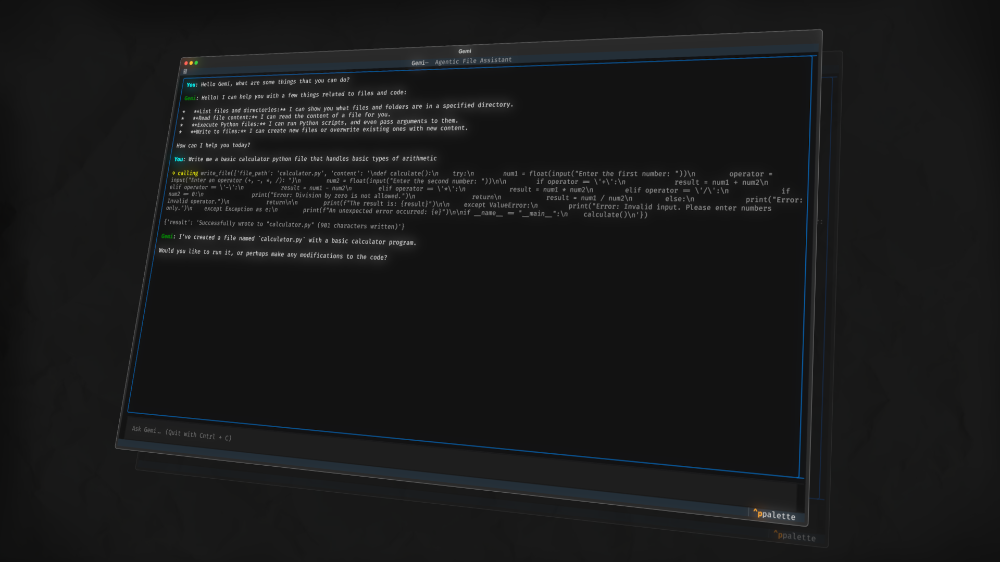

# Gemi

Gemi is a free, open-source AI agent powered by Google's **Gemini 2.5 Flash**. It can browse your files, read them, write new ones, and even run Python scripts to help you with coding tasks. (More features are WIP)

It comes with a friendly terminal interface (TUI) so you can chat with it like a normal app, and everything it does stays inside a safe sandbox folder so it can't touch the rest of your computer.

## What Gemi can do

- **List files and folders** in your project
- **Read file contents** to understand your code
- **Write or update files** for you
- **Run Python scripts** and report back the results

## Installation

You'll need two things before you start:

1. **Python 3.13 or newer** — download it from [python.org](https://www.python.org/downloads/) if you don't have it.
2. **A free Gemini API key** — get one in a couple of clicks at [Google AI Studio](https://aistudio.google.com/app/apikey).

Then follow these steps:

### 1. Download Gemi

```bash
git clone https://github.com/andrefetch/Gemi.git
cd Gemi
```

### 2. Install what it needs

```bash
pip install -r requirements.txt
```

### 3. Add your API key

Create a file named `.env` in the Gemi folder and paste your key inside it like this:

```text
GEMINI_API_KEY=your_key_here
```

(Replace `your_key_here` with the key you copied from Google AI Studio.)

## Using Gemi

The easiest way to start is the chat interface:

```bash
./gemi.sh
```

Then just type what you'd like Gemi to do and press Enter. Press `Cntrl+C` whenever you want to quit.

Prefer a quick one-off command instead of the chat window? You can ask Gemi a single question straight from your terminal:

```bash
gemi "list the files in this project"
```

Add `--verbose` if you'd like to see exactly what Gemi is doing behind the scenes.

## Contributing

Gemi is open source and contributions are very welcome. If you'd like to add a feature or fix something, feel free to open a Pull Request, thanks for helping out!
